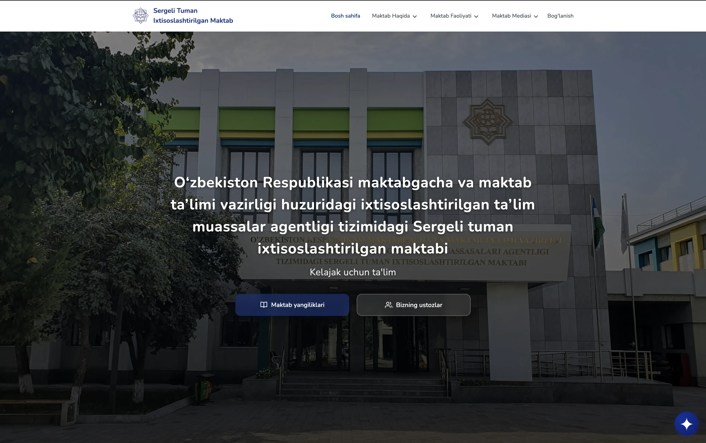
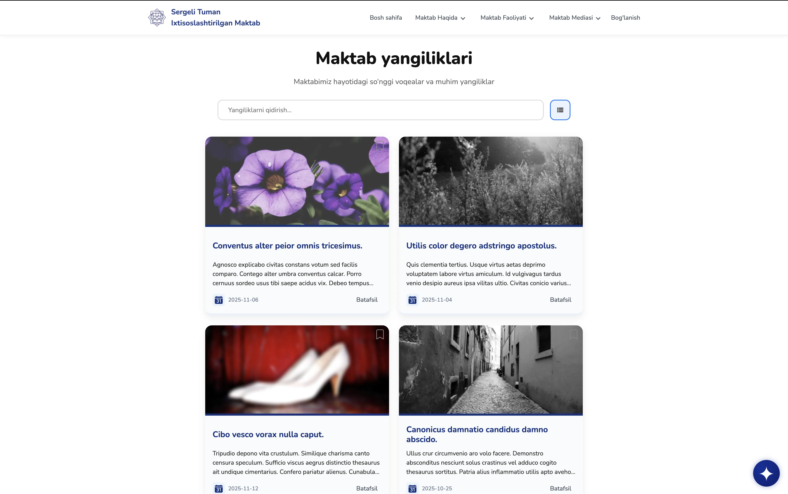
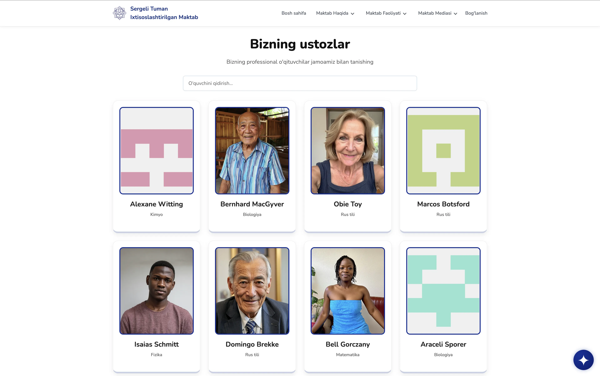
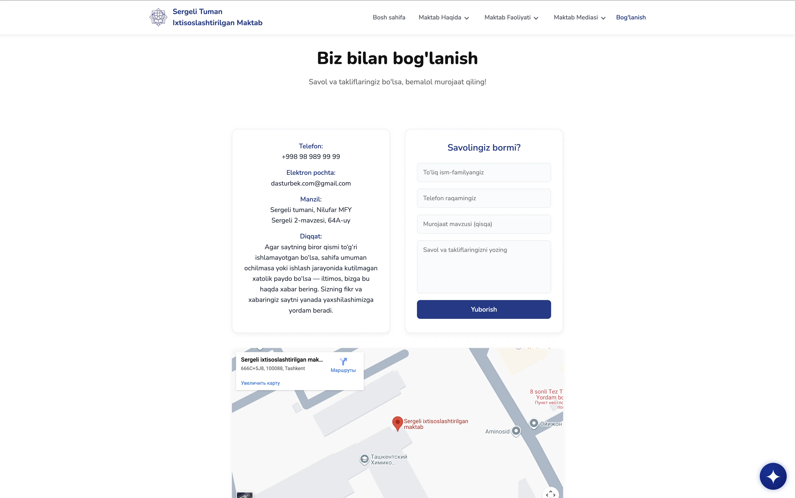
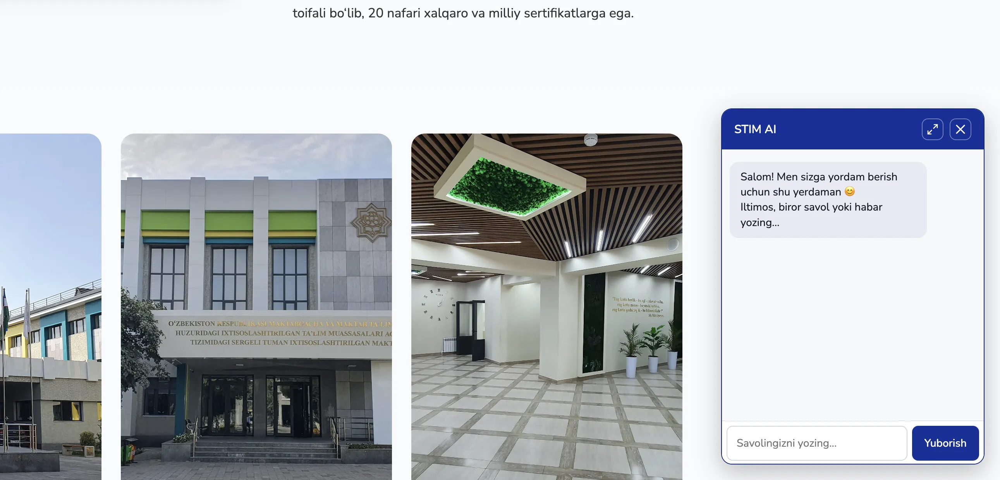

# 🏫 Sergeli Specialized School - Information Portal

[](https://reactjs.org/)
[](https://vitejs.dev/)
[](https://www.w3.org/Style/CSS/)
[](https://developer.mozilla.org/en-US/docs/Learn/CSS/CSS_layout/Responsive_Design)
[](https://opensource.org/licenses/MIT)

> 🌟 **Modern, interactive and user-friendly school information portal** - Created for the specialized school in Sergeli district.



## 📖 Description

This project is a fully functional information and data portal created for the specialized school in Sergeli district. The site is built on React technology and is enriched with news, announcements, teachers, clubs, and other important information. It provides users with convenient navigation, fast loading, and a mobile-responsive design.

### 🎯 Main Goals

- 📚 Provide complete information about the school
- 📰 Deliver news and announcements in real-time
- 👨‍🏫 Create detailed profiles for teachers
- 🎨 Information about clubs and additional activities
- 🤖 Answer questions using Artificial Intelligence
- 📱 Work perfectly on all devices

## ✨ Features

### 🚀 Core Functions
- ✅ **Dynamic News** - Real-time news updates via API
- ✅ **Interactive Announcements** - Quickly deliver important messages
- ✅ **Teacher Profiles** - Individual pages for each teacher
- ✅ **Clubs Section** - About all clubs in the school
- ✅ **AI Chat Bot** - Assistant based on Google Gemini
- ✅ **Responsive Design** - For desktop, tablet, and mobile
- ✅ **Smooth Animations** - With AOS library
- ✅ **Bookmark Function** - Save favorite news
- ✅ **Search System** - Quickly find information

### 🎨 Design Features
- 🎭 **Modern UI/UX** - Aligned with user experience
- 🌈 **Gradient Effects** - Beautiful color transitions
- 📱 **Mobile-First** - Mobile first, then desktop
- 🎯 **Intuitive Navigation** - Easy navigation
- ⚡ **Fast Loading** - Optimized for speed

## 🛠 Technologies

### Frontend


### Libraries and Frameworks
- **React Router DOM** - Navigation between pages
- **AOS (Animate On Scroll)** - Page animations
- **React Icons** - A collection of beautiful icons
- **Google Generative AI** - For AI chat functionality

### Backend & API
- **JSON Server** - Database simulation
- **REST API** - Data transfer
- **Fetch API** - Asynchronous data retrieval

## 📂 Project Structure

```
school-website/
├── public/
│   ├── service-worker.js
│   └── logo.svg
├── src/
│   ├── components/
│   │   ├── Header/
│   │   ├── Footer/
│   │   ├── Chat/
│   │   ├── Layout/
│   │   └── ...
│   ├── pages/
│   │   ├── Home/
│   │   ├── News/
│   │   ├── Teachers/
│   │   ├── Contact/
│   │   └── ...
│   ├── App.jsx
│   ├── main.jsx
│   └── index.css
├── .env
├── package.json
├── vite.config.js
└── README.md
```

### 📄 Pages
- **🏠 Home** - Main page, news, and announcements
- **📰 News** - News list and filters
- **👨‍🏫 Teachers** - Information about teachers
- **🎨 Talented Students** - Gifted students
- **📞 Contact** - Contact details and form
- **📢 Announcements** - Important announcements
- **🔬 Scientific Works** - Scientific research
- **📅 Schedule** - Class schedule

## 🚀 Installation and Setup

### Requirements
- Node.js (v16 or higher)
- npm or yarn

### Steps

1. **Clone the Repository**
   ```bash
   git clone https://github.com/your-username/school-website.git
   cd school-website
   ```

2. **Install Dependencies**
   ```bash
   npm install
   ```

3. **Create Environment File**
   ```bash
   cp .env.example .env
   ```
   Add API keys in the `.env` file:
   ```
   VITE_GOOGLE_GEMINI_API_KEY=your_api_key_here
   ```

4. **Run JSON Server** (for data)
   ```bash
   npx json-server --watch db.json --port 3000
   ```

5. **Start the Site**
   ```bash
   npm run dev
   ```

6. **Open in Browser**
   ```
   http://localhost:5173
   ```

## 📸 Screenshots

### 🏠 Home Page

*Home Page - News and Navigation*

### 📰 News Page

*News List and Search Functionality*

### 👨‍🏫 Teachers Page

*Teacher Profiles and Information*

### 📞 Contact Page

*Contact Form and Google Maps*

### 🤖 AI Chat

*AI Assistant Chat*

## 🎮 Usage

### Navigation
- Use the header menu to navigate between pages
- Additional links are available in the footer
- Burger menu works on the mobile version

### Chat Bot
- Gemini icon at the bottom right of the page
- AI helps with your questions
- Use it to get information about the school

### Responsive Design
- Desktop: Full functionality
- Tablet: Responsive layout
- Mobile: Touch-friendly interface

## 🤝 Contributing

Want to contribute? Great!

1. Fork the project
2. Create your feature branch (`git checkout -b feature/amazing-feature`)
3. Commit your changes (`git commit -m 'Add amazing feature'`)
4. Push to the branch (`git push origin feature/amazing-feature`)
5. Open a Pull Request

### Development Guidelines
- Follow ESLint rules
- Write modular components
- Use CSS BEM methodology
- Ensure commit messages are clear and descriptive

## 📄 License

This project is distributed under the MIT License. See the `LICENSE` file for more information.

## 👥 Authors

- **Jahongir To'xtayev** - Frontend Developer & UI/UX Designer
- **Adham Jabborov** - Frontend Developer

## 🙏 Acknowledgments

- Thanks to the React team for the amazing framework
- Thanks to the Google Gemini team for the AI API
- To all open-source contributors

---

<div align="center">

**🌟 Did you like this site? Give it a star on GitHub! 🌟**

[](https://github.com/your-username/school-website)
[](https://github.com/your-username/school-website/fork)

</div>

---

**📧 Have questions?** [Go to the Contact page](contact) or [open an issue](https://github.com/your-username/school-website/issues).